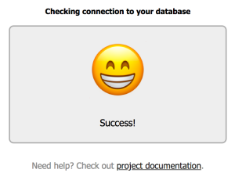

# DBCheck

Use this web app to test your database connection using a JDBC driver.

This app is suited to be deployed in Cloud environments (such as Cloud Foundry),
but you should be able to run it as a regular JAR program.
It's written in Kotlin, using Spring Boot, Spring MVC and Spring Cloud.

## How to use it?

### Add a JDBC driver

First, you need a JDBC driver: this app does not contain any driver.
If you're using a database with your app, you should already know which
JDBC driver you need to use.

Once you know which JDBC driver to use, you need to include it to this project.
The easiest way to do it is to compile this project after adding the
JDBC driver to this project dependencies:

 - Edit the file [pom.xml](pom.xml)
 - Go to the dependencies section
 - Add a dependency to the Maven artifact corresponding to your JDBC driver
 - Compile this project: `mvn clean package`

### Configure this app

After compiling this project, you now have a runnable JAR in the `target` directory.

#### Deploy to Cloud Foundry

If you're deploying this app to Cloud Foundry, the only thing you need to do is to bind your app
to your service database. This service must be named `db`: the app will automatically try to connect
to your database using this service.

Just run this command, and you're good to go: `cf push -p target/dbcheck-VERSION.jar`

#### Run as a regular JAR file

If you're running this app as a regular JAR, you need to set some of the following properties:

 - `dbcheck.url`: JDBC URL to the database
 - `dbcheck.user`: user name to connect to the database
 - `dbcheck.password`: user password
 - `dbcheck.query`: SQL query to run for validating a connection (optional)
 - `dbcheck.driver`: FQCN of the JDBC driver (optional)
 
Set these properties by using System properties when invoking the JAR file.

Example: `java -Ddbcheck.url=jdbc:hsqldb:hsql://dbhost -Ddbcheck.user=SA -Ddbcheck.password=whocares "-Ddbcheck.query=SELECT COUNT(*) FROM users" -jar dbcheck-VERSION.jar`

Since this app is using [Spring Boot](http://spring.io/projects/spring-boot),
you may need to set [additional properties](https://docs.spring.io/spring-boot/docs/current/reference/html/common-application-properties.html),
like the server port (8080 by default).

### Check database connection

Navigate to `http://localhost:8080`.
You should see the following screen:

In case everything is working fine, a smiling emoji should be displayed :)

## Contribute

Contributions are always welcome!

Feel free to open issues & send PR.

## License

Copyright &copy; 2018 Alexandre Roman.

This project is licensed under the [Apache Software License version 2.0](https://www.apache.org/licenses/LICENSE-2.0).
